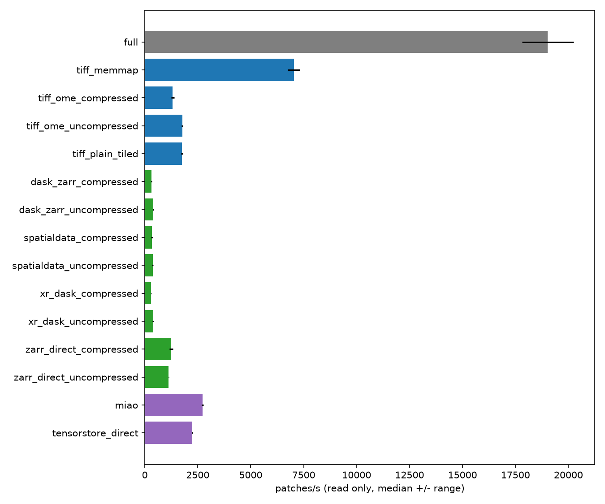
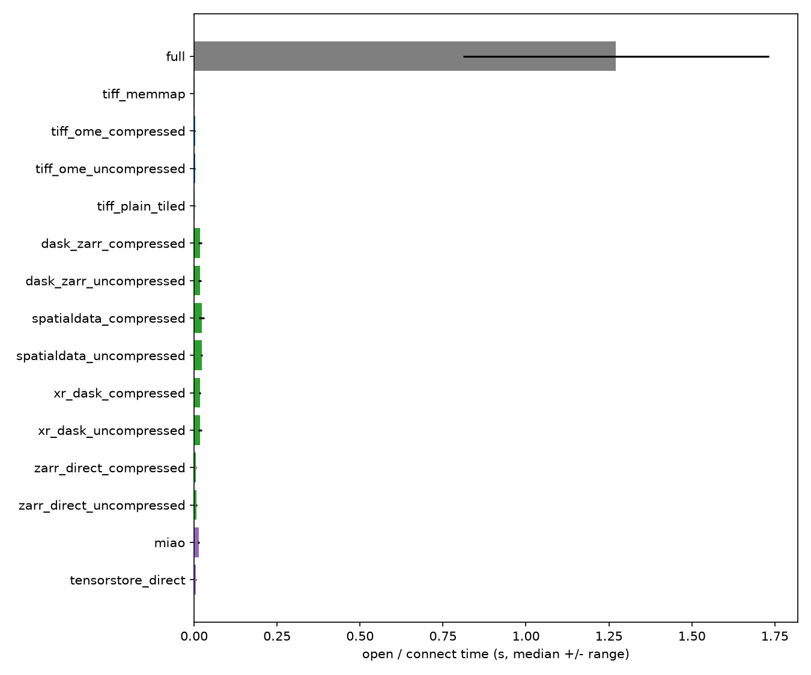

# dataloader-bench

How fast can random 256x256 patches be read from a large microscopy image
into a PyTorch `DataLoader`? This benchmarks OME-TIFF (`tifffile`, raw
memmap) against Zarr / OME-Zarr (`zarr-python` + `zarrs`, `dask`, `xarray`,
`SpatialData`, `tensorstore`, `miao`), on CPU only.

## Why this matters: the read-amplification effect

The source image is stored in on-disk chunks/tiles of `CHUNK` pixels
(default 512x512). Each requested patch is `PATCH_SIZE` pixels (default
256x256), placed at a random offset. A random 256px patch almost always
straddles a chunk boundary, so decoding it typically touches **more than
one** 512px chunk even though it only needs a quarter of each. This
over-fetch -- "read amplification" -- is a property of the chunk/patch size
ratio, not of any particular library, and it's one reason smaller-chunk /
better-aligned layouts can win even when they add per-chunk overhead.

## Future work: random vs. grid coordinates

Right now every method is benchmarked only on the 500 scattered random
patches described above. A natural follow-up: add a second coordinate
pattern -- a non-overlapping, `PATCH_SIZE`-aligned grid of tiles, top-left
first, row-major -- and run every method on both.

The random pattern is the realistic one (a training dataloader doing
random-crop augmentation), and is the worst case for read amplification,
since a patch almost never lines up with a chunk boundary. A grid pattern
would isolate that effect directly: comparing grid vs. random throughput for
the *same* method measures read amplification (a patch spanning multiple
on-disk chunks) and chunk reuse (sequential neighbors sharing an
already-decoded chunk) instead of just asserting it in prose, as this
section currently does.

It would also finally let `miao` be compared against everything else on
equal footing: `VolumeDataset` doesn't accept external coordinates, so right
now it has no entry in the shared comparison at all (see "miao caveat"
below) -- a grid pattern similar to its own internal `sampling="sequential"`
mode is the natural way to make it comparable, since its own grid is the
*same kind* of access even if not byte-identical to an independently-built
one.

This was prototyped once and rolled back -- it worked, but added enough
surface area (mode-parameterized output paths, a second coordinate builder,
per-mode method filtering, a comparison report) that it felt like it should
land as its own deliberate change rather than bundled into this pass.
Picking it back up mainly means: a `coords.py` with a grid-tile builder next
to the existing random one, teaching the runner/plotting to tag outputs by
mode, and a small comparison report (`grid patches/s ÷ random patches/s` per
method).

## The method ladder

The point of comparing these specific methods, in this order, is to locate
*where* in the stack time goes -- each step adds one layer on top of the
previous one's cost:

| # | Method | What it isolates |
|---|---|---|
| 1 | `full` (cv2, whole image in RAM) | Upper bound / naive baseline |
| 2-5 | TIFF family (OME compressed/uncompressed, plain tiled, memmap) | Tile-based lazy decode vs. raw OS-level mmap; cost of compression; whether OME-XML metadata itself adds overhead |
| 6-7 | `zarr_direct` (compressed / uncompressed) | Raw scale-0 zarr array via zarr-python + the `zarrs` Rust codec pipeline -- floor of the Zarr-based path |
| 8-9 | `dask_zarr` | + `dask.array.from_zarr` overhead on top of (6-7) |
| 10-11 | `xr_dask` | + `xarray.DataArray` wrapping overhead on top of (8-9) |
| 12-13 | `spatialdata` (`read_zarr`) | + full SpatialData read-path overhead on top of (10-11) |
| 14 | `tensorstore_direct` | Plain tensorstore (C++) read of the same scale-0 array (compressed store) -- compare with 6 to separate the zarr *format* from the zarr-python *library*; also the base layer under miao |
| 15 | `miao` | + miao's own overhead on top of (14) -- **only once both read the same coordinates**; currently miao samples its own grid (see caveat) |

Compressed vs. uncompressed scale-0 arrays (6/7, 8/9, 10/11, 12/13) isolate
decompression cost specifically; everything else about those pairs is
identical.

## How to read the results

- **Open/connect time** and **read time** are reported and plotted
  separately. Opening a whole-image array into RAM (method 1) is *not*
  counted as part of its "read" time, and no method's handle-opening cost
  leaks into another method's numbers.
- Every number reflects a **warm OS page cache** unless you drop caches
  between runs yourself (`sync; echo 3 > /proc/sys/vm/drop_caches` on Linux;
  there's no exact equivalent on Windows -- reboot or use a tool like
  RAMMap). Cold-cache numbers for a network share can look very different.
- Each method runs `--warmup-runs` (default 1, discarded) then
  `--timed-runs` (default 5) times; the CSV/plots report the **median** and
  the **min-max spread** across those timed runs, not a single sample.
- `--num-workers 0` (the default) measures "open once, read N times" in a
  single process. With `--num-workers > 0`, each worker process must open
  its own handle; that per-worker open cost is measured and reported
  separately from read throughput, which is the only part worth comparing
  across methods at that point.
- A method that fails prints its error and is skipped; every other method
  still runs and gets plotted.

## Compressed vs. uncompressed, local vs. network storage

Compression trades CPU time (decode cost, paid on every read) for disk
space. Whether that trade is worth it depends on where the data lives: on a
fast local SSD, decode cost tends to dominate and uncompressed can win; on a
network share, the bytes saved by compression can matter more than the CPU
cost of decoding them, because network bandwidth / latency is usually the
bottleneck instead. `environment.json` (written on every run, see below)
records a best-effort guess at whether `--data-dir` is a local disk or a
network share, so results from different environments aren't silently
compared as if they were equivalent.

## Reproducing

```bash
pip install -r requirements.txt
python scripts/run_benchmark.py --data-dir ./data
```

Useful flags:

```bash
# use your own image instead of the Xenium dataset (page 0 is read; any TIFF works)
python scripts/run_benchmark.py --data-dir ./data --src /path/to/your_image.tif

# CI / quick smoke test, no download, no real dataset
python scripts/run_benchmark.py --data-dir ./ci-data --synthetic --n-patches 20

# only run a subset of methods
python scripts/run_benchmark.py --data-dir ./data --methods full tiff_memmap miao
```

Before running against the real dataset, set the Dropbox direct-download
link in `src/dataloader_bench/config.py` (`BenchConfig.src_url`, `dl=1`) --
or just drop the source TIFF into `--data-dir` yourself and it'll be used
as-is.

Outputs land in `--data-dir`: `results.csv`, `results_throughput.png`,
`results_open.png`, `environment.json` (python/numpy/zarr/zarrs/
tifffile/dask/xarray/spatialdata/tensorstore/torch versions, OS, CPU, and
the local-disk-vs-network-share guess).

## Adding a new method

Add one file under `src/dataloader_bench/methods/`, implement `open()` +
`read_patch(y, x, patch_size)`, decorate the factory function with
`@register("your_name")`, import the module from `methods/__init__.py`, and
add `"your_name"` to `BenchConfig.methods`. That's the whole contract --
nothing else in the runner, verifier, or plotting code needs to change.

## miao caveat

`miao.VolumeDataset` samples patches itself (randomly, or on a fixed grid in
`sampling="sequential"` mode) -- it doesn't accept externally-chosen
coordinates. Because of that, the pixel-identity check for `miao`
specifically verifies against the coordinates *it* picked (read back from
its sequential grid), not the shared random-coordinate list every other
method is checked against. It's still benchmarked for throughput alongside
everyone else (reading its own sequential grid rather than the shared
random coordinates)

Because its grid is chunk-aligned and sequential (each patch sits inside one
chunk and neighbours reuse it), miao's throughput reflects an easier access
pattern than the random patches every other method reads. **Its number is not
directly comparable** to the other rows yet.

## Results

One run against a Xenium Breast Cancer IF Image (500 random 256x256 patches, batch
32, 1 warmup + 5 timed runs, single process, warm OS page cache -- see
caveats above), from `--data-dir ../data` (run from the repo root). Full
precision and per-run spread in `../data/results.csv`; environment details
in `../data/environment.json`.

| Method | Family | open (s, median) | read (s, median) | patches/s (median) |
|---|---|---|---|---|
| full | baseline | 0.6005 | 0.0263 | 19,022 |
| tiff_ome_uncompressed | tiff | 0.0013 | 0.2824 | 1,771 |
| tiff_ome_compressed | tiff | 0.0012 | 0.3810 | 1,312 |
| tiff_plain_tiled | tiff | 0.0011 | 0.2844 | 1,758 |
| tiff_memmap | tiff | 0.0006 | 0.0711 | 7,034 |
| zarr_direct_compressed | zarr_ladder | 0.0023 | 0.4014 | 1,246 |
| zarr_direct_uncompressed | zarr_ladder | 0.0022 | 0.4440 | 1,126 |
| dask_zarr_compressed | zarr_ladder | 0.0058 | 1.6236 | 308 |
| dask_zarr_uncompressed | zarr_ladder | 0.0058 | 1.2472 | 401 |
| xr_dask_compressed | zarr_ladder | 0.0060 | 1.6495 | 303 |
| xr_dask_uncompressed | zarr_ladder | 0.0059 | 1.2624 | 396 |
| spatialdata_compressed | zarr_ladder | 0.0081 | 1.4770 | 339 |
| spatialdata_uncompressed | zarr_ladder | 0.0078 | 1.3591 | 368 |
| tensorstore_direct | miao_ladder | 0.0023 | 0.2235 | 2,238 |
| miao | miao_ladder | 0.0052 | 0.1830 | 2,732 |




